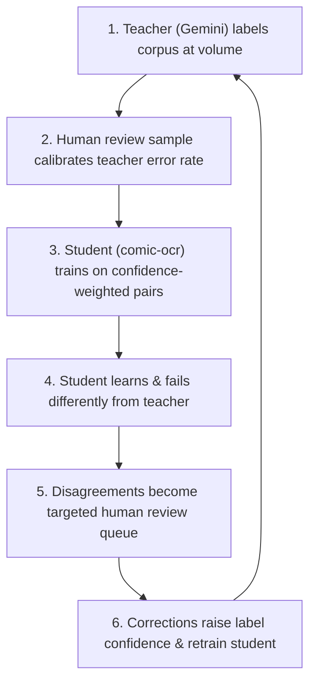

# The Flywheel, Distillation & Independent Reader Architectural Doctrine

Status: **Normative Architectural Doctrine**. Revised 2026-08-20.

---

## 1. What Is Actually Being Trained

The training target is **not** "a general manga model." It is a **`VisionEncoderDecoderModel`**:

- **Vision Encoder**: ViT / DeiT (e.g. `facebook/deit-tiny-patch16-224` or `google/vit-base-patch16-224`).
- **Text Decoder**: Causal Transformer paired with a 6k character-level Japanese vocabulary (or English ASCII vocabulary).

$$\text{Model Signature: } f(\text{Cropped Text Region Image}) \longrightarrow \text{Text String}$$

The model never sees a full page. It sees the cropped interior of a speech balloon or text region and emits the character sequence inside it. Page geometry, panels, reading order, and spreads are upstream pipeline context that produce the crop, not something the model learns.

That narrowness is why this model is trainable and reproducible: "understand a comic" is an un-learnable objective; "read this box" is a well-formed mathematical task.

---

## 2. Derivation of Training Pairs & Composed Confidence

A training pair is manufactured by projecting over two elements the pipeline already produces:

- **Crop**: `regions[].geometry.normalizedBounds` applied to the stored page bytes in CAS.
- **Label**: `textLayers[].regions[].text`, joined by `regionId`.

The pair is a graph projection query, not a manual capture step.

### Composed Confidence Equation

A pair's trustworthiness is the product of two independent steps being correct:

1. Was the bounding box correct? ($\mathbf{C}_{\text{det}}$)
2. Was the text transcription correct? ($\mathbf{C}_{\text{trans}}$)

$$\mathbf{C}_{\text{pair}} = \mathbf{C}_{\text{det}} \times \mathbf{C}_{\text{trans}}$$

A perfect transcription of a wrong bounding box is a bad pair. A garbled transcription of a perfect box is a bad pair. Pair confidence must combine the detector's confidence and the transcriber's confidence into a single scalar $\mathbf{C}_{\text{pair}} \in [0.0, 1.0]$.

---

## 3. Distillation with Error Correction

Training a student model (`comic-ocr-rust`) to replace the teacher (Gemini `vision-worker` / `ocr-detector`) is **knowledge distillation**.

Standard distillation has a hard ceiling: **the student inherits the teacher's systematic errors** because those errors are consistently present in the training signal.

The ceiling is broken by two error-correction mechanisms:

1. **Human Review Samples**: Targeted human verification on small samples calibrates the teacher's confidence.
2. **Cross-Model Disagreement**: Locates where the teacher is unreliable without requiring human intervention on every page.

---

## 4. The Independent Reader Principle ("Our Model + 3rd Party")

Agreement between two models is informative **only to the degree their errors are uncorrelated**.

- Sibling models (e.g., `gemini-2.5-pro` evaluating `gemini-2.5-flash`) share training data, architectural priors, and failure modes. Agreement between siblings is cheap and carries low information.
- `comic-ocr-rust` is a **genuinely independent reader** (different architecture, different vocabulary, different training signal).

```
   [Gemini Teacher (Gemini 2.5)]               [comic-ocr-rust Student (ViT-DeiT)]
               \                                        /
                \                                      /
                 v                                    v
          +--------------------------------------------------+
          |         Cross-Model Disagreement Matrix          |
          +--------------------------------------------------+
          | Agreement   => High confidence (Auto-Admitted)   |
          | Disagreement => High-value Human Review Queue    |
          +--------------------------------------------------+
```

When `comic-ocr-rust` and Gemini agree, that agreement carries real mathematical evidence. When they disagree, the disagreement isolates exact error locations for human review queues.

---

## 5. The Correction Flywheel Mechanics



**The Flywheel Invariant**: As the student improves, cross-model disagreement becomes **more** informative, not less. Disagreements shrink in quantity and concentrate strictly where at least one reader is wrong.

---

## 6. Human Labels: Irreplaceable for Held-Out Evaluation

Human labels are essential, but **not for training**. Human labels are the **Held-Out Test Set**.

- Measuring accuracy against machine labels measures agreement with the teacher (distillation score), not true reading accuracy.
- A student scoring 99% against Gemini labels has learned to imitate Gemini's mistakes.
- A held-out evaluation set of a few hundred human-labeled regions—never trained on—is the only valid accuracy benchmark.

---

## 7. Named Failure Modes & Mitigation Controls

| Failure Mode | Description | Mitigation Control |
| :--- | :--- | :--- |
| **Confirmation Loop** | Training and validating against the same teacher model. | Enforce held-out human-annotated test set (`package 0000`). |
| **Correlated Judges** | Relying on sibling model agreement for confidence. | Treat `comic-ocr-rust` as an independent reader paired against 3rd party. |
| **Crop Drift** | Resolution mismatch between training crops and serving crops. | Store `normalized_bounds` in `[0, 1]` and re-derive crops at target resolution. |
| **Empty Labels** | Dropped transcriptions mistaken for blank speech balloons. | Enforce `empty_is_intentional: true` for deliberate empty region labels. |
