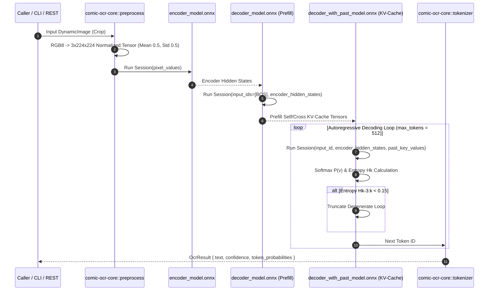

# Rust Migration Specification: Inference Bridge, Python Wheel & Neural Architecture

This document defines the normative architectural specifications, implementation blueprints, status honesty bounds, and migration gates to complete the transition of **Comic OCR Rust** (`comic-ocr-rust`) from Python hybrid execution to a pure, zero-cost Rust runtime environment.

---

## 1. Status Honesty & Inventory Ledger

To prevent aspirational design intent from being misread as shipped inventory ($Documented \neq Implemented \neq Tested \neq Empirically Validated$), system components are categorized strictly:

| Component | Status | Empirical Reality |
| :--- | :--- | :--- |
| **`comic-ocr-core` Domain Primitives** | **Tested** | 69 unit tests passing. Furigana FSM, row-bucket sorting, and 5-layer validation engine active. |
| **Rust Decoder KV-Cache Loop (`generate.rs`)** | **Implemented (Unverified)** | Code present in [`crates/comic-ocr-ort/src/generate.rs`](file:///Users/zachshallbetter/Projects/comic-ocr-rust/crates/comic-ocr-ort/src/generate.rs). Cannot execute until `scripts/export_onnx.py` produces ONNX model graphs in `models/onnx/`. |
| **Subprocess Python Inference Bridge** | **Implemented & Active** | Default runtime path (`OrtEngine::predict`) invoking PyTorch via `std::process::Command` with zero hardcoded confidence. |
| **PDP Multi-Engine Consensus (`comic-ocr-pdp`)** | **Documented (Design Intent)** | [`crates/comic-ocr-pdp`](file:///Users/zachshallbetter/Projects/comic-ocr-rust/crates/comic-ocr-pdp) contains 70 lines of substrate types. Brier calibration and ACS discounting are **unbuilt**. |
| **Workspace Test Suite** | **Tested** | **87 passed, 2 ignored** (out of 89 total test targets across workspace). |
| **Local Benchmark Corpus** | **Empirically Validated** | **22 local dataset images** (`tests/data/benchmark_results.json`). *(Note: 830 pages refers to `manga-service` platform `panel-detector` staging coverage, not local workspace fixtures).* |

---

## 2. Inference Bridge Migration: Python Subprocess -> Pure Rust ONNX Runtime

### Current Architecture
Currently, default neural recognition uses `OrtEngine::predict` in [`crates/comic-ocr-ort/src/lib.rs`](file:///Users/zachshallbetter/Projects/comic-ocr-rust/crates/comic-ocr-ort/src/lib.rs) executing an inline Python 3 script via `std::process::Command` using PyTorch (`transformers`, `torch`, `PIL`).

### The Pure Rust Target Architecture (`generate.rs`)
The native Rust KV-cache generator in [`crates/comic-ocr-ort/src/generate.rs`](file:///Users/zachshallbetter/Projects/comic-ocr-rust/crates/comic-ocr-ort/src/generate.rs) eliminates Python subprocess invocation by driving three C++ ONNX Runtime sessions directly.



### Unblocking Phase 9 Execution: Graph Restoration
To unblock empirical testing of `generate.rs`, the ONNX export script must be executed to generate the model files specified in [`docs/ONNX_GRAPH_CONTRACT.md`](file:///Users/zachshallbetter/Projects/comic-ocr-rust/docs/ONNX_GRAPH_CONTRACT.md):

```bash
python3 scripts/export_onnx.py --model kha-white/manga-ocr --output-dir models/onnx
```

---

## 3. Python Wheel Specification (`comic-ocr-py`)

### Purpose & Architecture
[`crates/comic-ocr-py`](file:///Users/zachshallbetter/Projects/comic-ocr-rust/crates/comic-ocr-py) provides high-performance Maturin C-extension PyO3 bindings (`comic_ocr_rs`) so external Python ingest pipelines (`manga-service`, `anime-universe`) can execute Rust layout sorting, Furigana extraction, reading order validation, and tokenizers without IPC overhead.

### PyO3 C-Extension Boundaries
- **Zero-Copy Memory Exchange**: Image buffers passed from Python `PIL.Image` or `bytes` into Rust PyO3 routines using `&[u8]` slice references.
- **Single Post-Processing Pipeline**: PyO3 methods delegate directly to `comic_ocr_core::post_process_with_furigana` to prevent double-processing bugs.
- **Type Stubs (`comic_ocr_rs.pyi`)**: Maintain explicit PEP 561 typing declarations for IDE auto-completion.

---

## 4. Platform Integration & Design Choice Boundaries

### Integration Strategy: Mode A vs. Mode B
- **Mode A (Transcriber)**: Consumes normalized crop bounds produced by `vision-worker` (Gemini) and transcribes text regions. This is a **Design Choice** that isolates OCR transcription performance from layout detection for side-by-side benchmark comparison against `ocr-detector`.
- **Mode B (Detector + Transcriber)**: Performs both layout detection (`TextDetector`) and transcription within `comic-ocr-rust`.

---

## Migration Acceptance & Verification Stack

```bash
# 1. Workspace Unit & Integration Tests (87 passed, 2 ignored)
cargo test --workspace

# 2. Strict Workspace Clippy Audit
cargo clippy --workspace --all-targets -- -D warnings

# 3. ONNX Model Export Generation
python3 scripts/export_onnx.py --model kha-white/manga-ocr --output-dir models/onnx

# 4. Context Corpus Generation
python3 scripts/gen-llms.py
```
