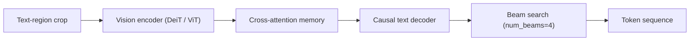

# Comic OCR Training

Two engines, not one bilingual model. This document describes both tracks, what
they share, and what is not built yet.

> **Status.** The training code this document describes does **not exist in this
> repository**. `comic_ocr_dev/training/` is referenced throughout the older
> version of this doc and is not present; the nearest implementation is a
> reference project at `_Reference-Projects/MangaOCR/TrOCR/training/`. Treat the
> file paths below as the intended layout, not as links to working code. Sections
> marked **Built** describe things that exist in this workspace today.

---

## Why two engines

The corpus this serves is bilingual and mostly English-localised — scans carry
English dialogue with Japanese sound effects left untranslated. One model
straddling both is the wrong shape, for four reasons:

1. **The vocabularies differ in kind.** Japanese needs char-level at ~6k tokens.
   English comic lettering is near-universally uppercase — a char-level vocab is
   under 100 tokens. A merged vocab makes both languages worse at their own job.
2. **English is close to free; Japanese is where training earns its keep.**
   Block uppercase Latin is a largely solved problem. Vertical Japanese with
   furigana and integrated SFX is not.
3. **Mixed pages are solved downstream, not in the model.** The consuming
   pipeline attaches *multiple engines to the same page with none superseding
   another*. A page with English dialogue and Japanese SFX is two engines both
   contributing — which is the existing design.
4. **The trait already exists.** `OcrEngine` is pluggable and
   `comic-ocr-core/src/languages/{en,jp}.rs` already splits post-processing by
   language. Two engines is the shape the workspace already has.

Selection is per publication from metadata, and per region from the detector.

---

## What both tracks share

### Architecture

Both are `VisionEncoderDecoderModel` — a vision encoder paired with a causal
text decoder.



Encoder: `facebook/deit-tiny-patch16-224` for the Nano profile, ViT-base for
Base. `is_decoder=False`, `add_cross_attention=False`.
Decoder: per track (below). `is_decoder=True`, `add_cross_attention=True`, depth
trimmable via `num_decoder_layers` — taking the top 2 layers is the standard
latency cut and is what the Nano profile assumes.

### Generation config

Identical for both tracks. **Greedy decoding is not equivalent** and will
under-report quality against these targets:

| Field | Value |
| :--- | :--- |
| `decoder_start_token_id` | `cls_token_id` |
| `pad_token_id` | `pad_token_id` |
| `eos_token_id` | `sep_token_id` |
| `num_beams` | 4 |
| `length_penalty` | 2.0 |
| `no_repeat_ngram_size` | 3 |
| `max_length` | 300 |

### Augmentations

Language-agnostic — this is scan-artifact robustness, and it applies unchanged to
both tracks.

| Tier | Probability | Operations |
| :--- | :--- | :--- |
| **None** | 18% | Standard grayscale conversion (`ToGray`). |
| **Medium** | 80% | Slight rotation (5°), perspective distortion, image inversion (5%), downscaling, blur, sharpening, brightness/contrast shift, Gaussian noise, JPEG compression (Q 0-30). |
| **Heavy** | 2% | Stronger rotation (10°), extreme downscaling (0.1x), heavy blur, intense noise, severe JPEG compression (Q 0-10). |

### Label masking

Labels padded to `max_target_length` (300). Padding tokens get id `-100` so
cross-entropy ignores them in backprop.

### Metrics

1. **Character Error Rate (CER)** — the headline number.
2. **Exact character accuracy** — `(pred_str == label_str).mean()`.

Report per-track and never pooled: a bilingual average hides a track that has
stopped working.

### Holdout Evaluation Set (The Human Test Set)

Under **The Training Contract** ([`docs/FLYWHEEL_DISTILLATION_ARCHITECTURAL_DOCTRINE.md`](FLYWHEEL_DISTILLATION_ARCHITECTURAL_DOCTRINE.md)), human annotations are **never** the primary training dataset — they form the **held-out evaluation test set**.

- Measuring accuracy against machine (teacher) labels measures imitation, not true reading ability.
- Package `0000` is strictly excluded from training (`skip_packages=[0]`) and reserved for independent human evaluation.
- Training loss operates over confidence-weighted machine pairs $\mathbf{C}_{\text{pair}} = \mathbf{C}_{\text{detector}} \times \mathbf{C}_{\text{transcriber}}$.

---

## Track A — Japanese

The track that justifies training rather than adopting.

- **Decoder vocab:** char-level, ~6k tokens. Covers kana, common kanji,
  punctuation and the ruby bracket forms.
- **Text geometry:** vertical right-to-left (`vertical-rl`) as the dominant mode,
  with horizontal runs and tate-chū-yoko patches.
- **Corpus:** synthetic packages plus real line annotations.
  **Manga109-s requires an agreement the project owner accepts personally** — it
  is not redistributable, cannot be vendored into this repository, and 87 of 109
  volumes carry the commercial grant. Do not add it to the pipeline before that
  agreement exists.
- **What makes it worth training:** furigana extraction, vertical reading order,
  and SFX handling. These are the capabilities no off-the-shelf checkpoint sells.

## Track B — English

- **Decoder vocab:** char-level, ~70–100 tokens — uppercase Latin, digits,
  punctuation, and the small set of glyphs comic lettering actually uses. This
  tiny decoder is most of how the Nano profile reaches its size target.
- **Text geometry:** horizontal left-to-right, Western panel reading order.
- **Corpus:** synthetic comic lettering is the realistic v1 source — rendered
  from comic display faces over scanned-paper backgrounds, run through the shared
  augmentation tiers. There is no English equivalent of Manga109-s to license.
- **Consider not training this at all in v1.** An off-the-shelf English OCR
  behind the same `OcrEngine` trait may be good enough to ship, and would free
  the entire training budget for Track A. Measure before committing.

---

## Deferred — Manhwa / Webtoon

Korean, vertical-scroll, full colour. In the project's stated scope but **not in
the v1 architecture**. It is a third vocabulary *and* a different page geometry —
long-strip rather than paged — which affects the region detector, not just the
decoder. Recorded here so it is a deliberate deferral rather than an oversight.

---

## Runner

```bash
python -m comic_ocr_dev.training.train \
  --track=ja \
  --run_name="comic-ocr-ja-v1" \
  --encoder_name="facebook/deit-tiny-patch16-224" \
  --decoder_name="<japanese-char-decoder>" \
  --batch_size=64 \
  --num_epochs=8 \
  --fp16=True
```

`--track` selects vocab, corpus and post-processing profile. Orchestrated with
`transformers.Seq2SeqTrainer` and `wandb` tracking.

---

## Export and serving — **Built**

Exported weights are consumed by `comic-ocr-ort` through ONNX Runtime. Two things
about that boundary are already true in this workspace and constrain what a
training run must emit:

- **Model identity is configuration with no default.** `COMIC_OCR_ONNX_PATH` and
  `COMIC_OCR_MODEL` have no built-in fallback; an unconfigured runtime reports
  `degraded` with `inference_available: false` rather than loading a model nobody
  chose. Each track ships its own artefact and its own path.
- **The tokenizer is vocab-file driven.** `comic-ocr-core::tokenizer` loads a
  BERT WordPiece `vocab.txt` and derives `cls`/`sep`/`pad`/`unk`/`mask` ids from
  it rather than assuming them, so both tracks use it unchanged. It refuses to
  load a vocab missing any required special token — which means `eos_token_id`
  above is always read, never assumed.

A `VisionEncoderDecoder` does not export to a single runnable ONNX graph. Expect
separate encoder / decoder / decoder-with-past graphs, with the autoregressive
loop living in the caller.
